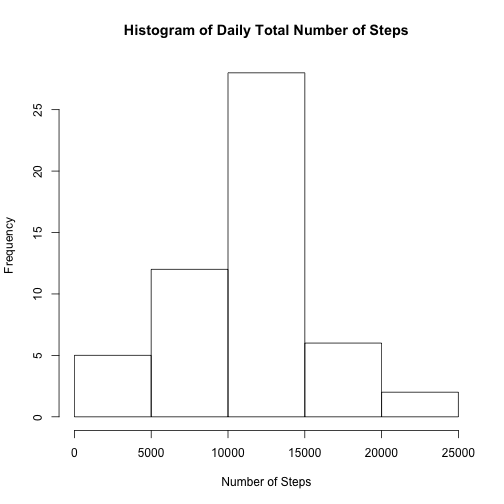
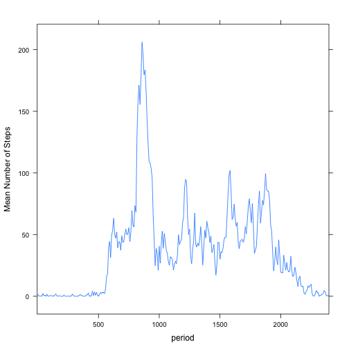
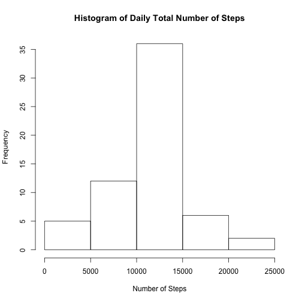
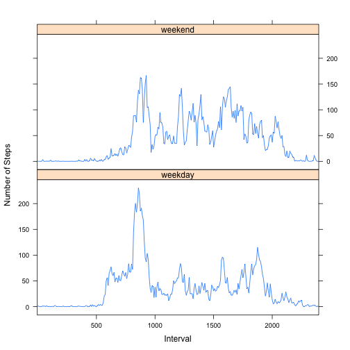

### Load required libraries

```r
library("readr")
library("dplyr")
library("lubridate")
library("lattice")
```

## Loading and preprocessing the data

### Load "Activity" data

```r
url <- "https://d396qusza40orc.cloudfront.net/repdata%2Fdata%2Factivity.zip"
destfile <- "zipped_data_file"

if (!file.exists(destfile)){
    download.file(url, destfile, method = "curl")
    file_names = unzip("zipped_data_file")
}

activity_data <- tbl_df(read_csv("activity.csv"))
```

### Preprocessing
The read activity data was preprocessed. By the end of the preprocessing, `activity_data` will have four additional colums - "time", "Date_Time", "y_day" and "period". To give more details, "time" indicates the clock reading at which the corresponding interval begins while "y_day" has the day of the year for a corresponding date in the "date" column of "activity_data". Moreover, "period"" can be thought of as an "id" for a given 5-minute interval.

The next two code chunks show the functions I used in preprocessing the data. The first, `format_interval`, returns the time at which given interval starts while `format_date_time` returns concatenated character string of a given date and time. 

```r
format_interval <- function(interval) {
    if (nchar(interval) < 4){
        zeros <-  as.character(rep(0, 4 - nchar(trimws(interval))))
        zeros <- paste(zeros, collapse = "")
        new_time <- paste(zeros, interval, collapse = "" )
        interval <- gsub(" ", "", new_time)
    }
    new_time <- vector("character", length = 5)
    time <- as.vector(strsplit(as.character(interval), ""))
    new_time[c(1,2,4,5)] <- time[[1]]
    new_time[3] <- ":"
    new_time <- paste(new_time, "", collapse = "")
    new_time <- gsub(" ", "", new_time)
    new_time <- paste(new_time, ":00", collapse = "")
    new_time <- gsub(" ", "", new_time)
    
    return(new_time)
}
```

```r
format_date_time <- function(day, time){
    date_time <- paste(day, time, sep = " ")
    return(date_time)
}
```
The following show how `format_interval` and `format_date_time` were used to add "time" and "Date_Time" columns to the original "activity_data"

```r
activity_data <- activity_data %>% mutate(time = sapply(as.character(interval), format_interval))
```


```r
date_time <- format_date_time(as.character(activity_data$date), activity_data$time)
```

The data in "Date_Time" column was used to create "y_day" and "period" as presented in the following code chunk.

```r
activity_data <- mutate(activity_data, Date_Time = ymd_hms(date_time) )
activity_data <- mutate(activity_data, y_day = as.factor(yday(activity_data$date)))
activity_data <- mutate(activity_data, period = hour(activity_data$Date_Time)*12 + (minute(activity_data$Date_Time)/5))
activity_data <- mutate(activity_data, period = as.factor(period))
activity_data <- group_by(activity_data, y_day)
```


## What is mean total number of steps taken per day?

```r
daily_total_num_steps <- summarize(activity_data, sum(steps))
daily_mean_num_steps <- round(mean(daily_total_num_steps$`sum(steps)`, na.rm = TRUE))
daily_median_num_steps <- median(daily_total_num_steps$`sum(steps)`, na.rm = TRUE)
```


```r
hist(daily_total_num_steps$`sum(steps)`, 
        xlab = "Number of Steps",
            main = "Histogram of Daily Total Number of Steps")
```



The **daily mean number of steps** for each day is **10766** while the **daily median number of steps** for each day is **10765**.


## What is the average daily activity pattern?

```r
activity_data <- ungroup(activity_data)
activity_data_no_na <- filter(activity_data, !is.na(activity_data$steps))
activity_data_no_na <- group_by(activity_data_no_na, period)
pattern <- summarize(activity_data_no_na, mean(steps))
names(pattern)[2] <- "num_of_steps"
xyplot(num_of_steps ~ period, , type = "l", ylab = "Mean Number of Steps", scales = list( 
           x = list(
               at = c(0, 61, 121, 181, 241),
               labels = c("0", "500", "1000", "1500", "2000")
           )
        ), data = pattern)
```




```r
max_period <- which(pattern$num_of_steps == max(pattern$num_of_steps))
interval <- activity_data$interval[max_period]
```
The interval with most number of steps is **835**.


## Imputing missing values
The following function imputes the missing values in the activity data.

```r
impute_steps <- function(period, pattern){
    num_steps <- pattern$`num_of_steps`[which(pattern$period == period)]
    return(num_steps)
}
```
Missing data is imputed as shown below.

```r
num_of_nas <- sum(is.na(activity_data$steps))
data_to_impute <- sapply(activity_data$period[which(is.na(activity_data$steps))], 
                                                            impute_steps, pattern)
new_activity_data <- activity_data
new_activity_data$steps[which(is.na(activity_data$steps))] <- data_to_impute

new_activity_data <- group_by(new_activity_data, y_day)
```
### New daily statistics

```r
new_daily_total_num_steps <- summarize(new_activity_data, sum(steps))
new_daily_mean_num_steps <- mean(new_daily_total_num_steps$`sum(steps)`, na.rm = TRUE)
new_daily_median_num_steps <- median(new_daily_total_num_steps$`sum(steps)`, na.rm = TRUE)

hist(new_daily_total_num_steps$`sum(steps)`, xlab = "Number of Steps",
     main = "Histogram of Daily Total Number of Steps")
```



The **daily mean number of steps** for each day is **10766** while the **daily median number of steps** for each day is **10766**.


## Are there differences in activity patterns between weekdays and weekends?

```r
wknd <- c("Sat", "Sun")

get_type_of_day <- function(day_date, wknd){
    if (weekdays(day_date, TRUE) %in% wknd) {
        day_type <- "weekend"
    } else {
        day_type <- "weekday"
    }
}


day_type <- as.factor(sapply(new_activity_data$date, get_type_of_day, wknd))
new_activity_data <- new_activity_data %>% ungroup() %>% 
                        mutate("day_type" = day_type, 
                               "interval" = as.factor(interval)) %>% 
                                        group_by(day_type, interval)
activity_summary <- new_activity_data %>% summarise(mean(steps))
names(activity_summary)[2:3] <- c("Interval", "Number of Steps")
xyplot(`Number of Steps` ~ Interval | day_type, activity_summary,
       layout = c(1, 2), type = "l", 
       xlab = "Interval",
       ylab = "Number of Steps",
       title = "Number of Steps vs Interval",
       scales = list( 
           x = list(
               at = c(0, 61, 121, 181, 241),
               labels = c("0", "500", "1000", "1500", "2000")
           )
        ) 
    )
```


